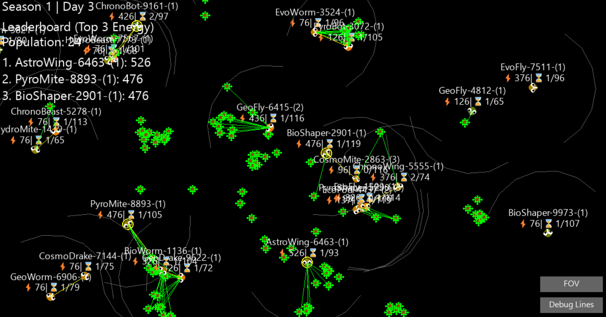

# EvoPi
Evolution simulator  
  A custom individual-creature focused evolutionary simulor with basic UI.  
    -4 seasons(minutes) separated by 60 days(seconds) as a game clock 
    -Food blooms seasonally and sprinkles daily 
    -Selectable creatures for view info purposes. 
    -Prefix/Suffix name generation. 
    -Stats are hereditary and include mutation rates. 
    -Game persists between sessions unless save file is deleted, progress will not be lost. 

Roadmap: 
Species 
Carnivores 
Expanded food mechanisms 

