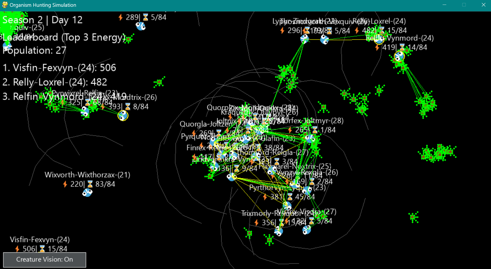
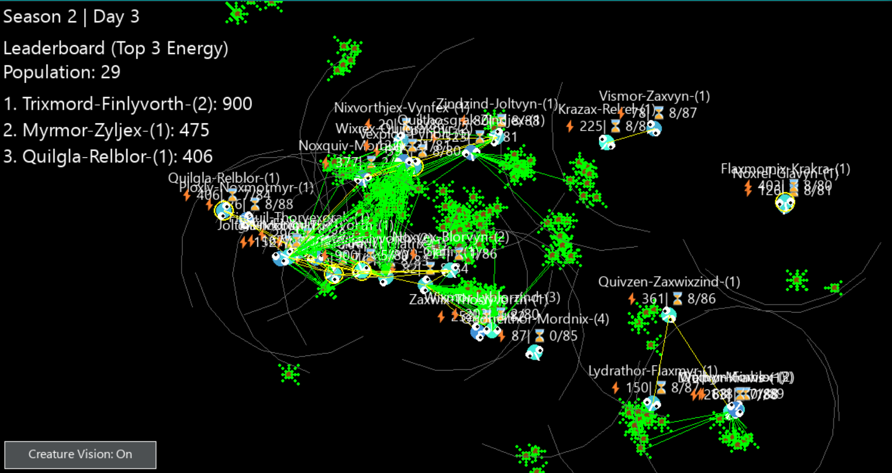

# Evolution Simulator 🌱🧬

A custom individual-creature focused evolutionary simulator with advanced genetics and optimized performance

## Simulation Preview 🔍

<div style="display: flex; overflow-x: auto; gap: 16px; padding: 16px 0;">
  <div style="flex: 0 0 auto; min-width: 300px; text-align: left;">
    
    
    <p> </p>
  </div>
</div>

## Seeking Collaboration: GPU-Accelerated Evolution 🤝
[Jump to GPU Acceleration Details](#gpu-acceleration-details) <br>
**I am a solo developer and seeking collaborators ** <br>
If you possess the skills and passion to contribute to this endeavor, I encourage you to reach out. Your expertise will be invaluable in pushing the boundaries of evolutionary simulation.

## Key Features 🔑

### Core Simulation
🕒 **4-Season Time System** - Minutes=seasons, seconds=days with automatic food blooms<br>
🌾 **Dynamic Food Ecosystem** - Seasonal respawning + daily sprinkles + cluster-based generation<br>
👀 **Selectable Creatures** - Click any organism to view real-time stats and genetic makeup<br>
🧠 **Smart Creature AI** - Food/mate seeking behaviors with FOV-based ray casting

### Cognitive Abilities 🧠

Our creatures are not just driven by simple instincts; they possess advanced cognitive abilities that enhance their survival and adaptation:

#### Advanced Memory System
* 🧠 **Spatial Food Memory** - Creatures maintain a mental map using spatial hashing:
    * 🗺️ **Grid-Based Recall** - 150px memory cells track historical food density
    * 🕒 **Probabilistic Decay** - Memories fade exponentially (5% loss/sec) unless reinforced
    * 🧭 **Smart Navigation** - Prioritize cells by density/distance/age using: `score = density × e^(-age/300) × (1 − distance/sight_range)`
* 🎯 **Persistent Pathfinding**
    * 🔄 **Target Locking** - Commit to navigation paths for minimum 2 second intervals
    * 🧲 **Persistence Bonus** - 50% score boost when revisiting previous targets
    * 🚦 **State Stability** - Require 3 consecutive food detections before goal switching
* 🤝 **Social Memory Sharing**
    * 💞 **Mating Knowledge Transfer** - Inherit partner's highest-density memories
    * 🧩 **Memory Fusion** - Combine parental maps during reproduction
    * 📡 **Epigenetic Weighting** - Recent memories influence gene activation

This sophisticated memory system allows creatures to learn from their environment, optimize their foraging, and pass on valuable knowledge to their offspring, contributing to more intelligent and adaptable populations.

### Genetic System
<br>🧬 **True DNA Simulation** - Genome/Gene class system with allele inheritance<br>
🎲 **Mutations** - Configurable mutation rates (0.1-5%) with dominance factors<br>
💞 **Sexual Reproduction** - Crossover breeding with trait combination<br>
🌈 **Trait Expression** - Physical traits derived from genetic combinations<br>
📜 **Epigenetic Effects** - Environmental factors influence gene activation

### Technical Highlights
<br>🚀 **Spatial Partitioning** - 150px grid system for 10x faster collision detection<br>
🖥️ **OpenGL Rendering** - Batched texture rendering with GraphicsRenderer class<br>
🧵 **Multithreaded Processing** - Async food generation and parallel ray casting<br>
💾 **Persistent World** - Auto-saves progress between sessions

### Advanced Mechanics
<br>⚡ **Energy System** - Metabolism/size/speed tradeoffs with hunger dynamics<br>
👓 **Vision System** - Customizable FOV (110-140°) and sight range (130-160px)<br>
🍎 **Complex Food** - Branching food structures with variable energy values<br>
📊 **Real-time UI** - Toggle debug overlays/FOV + leaderboard rankings

### Creature Details
<br>🔠 **Procedural Names** - Linguistically plausible name generation<br>
⏳ **Aging System** - Lifespan (80-90s) with age-related stats<br>
🎯 **Behavior States** - Food seeking/mating/wandering modes<br>
👥 **Social Interactions** - Energy-based mating rituals

## Roadmap 🗺️
Performance is CPU dependent and it's being addressed

### Next Major Features
<br>🦖 **Species System** - Carnivore/herbivore speciation<br>
🌐 **Expanded Food Web** - Multiple food types with nutritional values<br>
🧬 **Gene Regulation** - Activator/repressor gene networks

### Genetic Expansion
<br>🧩 **Pleiotropic Genes** - Single genes affecting multiple traits<br>
🎭 **Polygenic Traits** - Combined gene effects on characteristics<br>
⚠️ **Genetic Disorders** - Harmful mutation possibilities<br>
🌡️ **Environmental DNA** - Temperature-dependent gene expression

### Technical Upgrades
<br>🌐 **Distributed Computing** - Offload simulation to GPU<br>
📈 **Data Tracking** - Generational lineage graphs<br>
🎮 **Interactive Evolution** - Player-directed breeding

## Installation ⚙️

```bash
git clone [https://github.com/yourusername/evolution-simulator.git](https://github.com/yourusername/evolution-simulator.git)
cd evolution-simulator
pip install -r requirements.txt
python main.py
```
<a id="gpu-acceleration-details"></a>
## Planned GPU Acceleration Details 🚀
**I am a solo developer and seeking collaborators with expertise in:**
* **GPU Computing (CUDA, OpenCL, or similar):** Implementing core simulation logic on the GPU to leverage parallel processing capabilities.
* **GPU-Based Game Engines (e.g., Unity with compute shaders, Unreal Engine):** Assisting in the migration to a robust, GPU-optimized game engine.
* **Performance Optimization:** Identifying and addressing bottlenecks in GPU-accelerated simulations.
* **Parallel Algorithms:** Implementing efficient parallel algorithms for complex simulations.
**Benefits of GPU Acceleration:**
* Significant performance gains, allowing for larger populations and more intricate simulations.
* Improved visual fidelity and rendering capabilities.
* Potential for real-time interactive simulations with complex environments.
